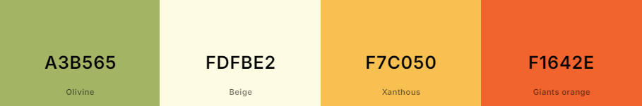

# Pet Adoption System

This Pet Adoption System is a simple REST API built with pure JavaScript (Node.js) that serves as a foundational learning project prior to using Express and MongoDB. The application allows users to perform CRUD operations on pet data, making it a great starting point for understanding RESTful services.

**NOTE:** Pet REST server not uploaded because of Professor's ownership.

## Features

- **RESTful API**: Provides endpoints for creating, reading, updating, and deleting pet information.
- **Data Storage**: Utilizes a simple in-memory JavaScript `Map` to store pet data, which includes:
  - Name
  - Species
  - Breed
  - Age
- **CORS Support**: Enables cross-origin requests for seamless integration with front-end applications.

## Front-End Design

To enhance the user experience, the front-end features a modern and elegant design achieved through custom CSS styling:

- **Responsive Design**: The layout is mobile-friendly, ensuring usability on various devices.
- **Form Styling**: Forms are designed for clean and user-friendly interaction, with clear focus states and intuitive button designs.
- **Pet List Presentation**: Pet information is displayed in an organized manner, utilizing cards for better visibility and aesthetics.
- **Google Fonts Integration**: Modern typography is applied to improve readability and overall look.
- **Color palette**: 

    <!--  -->

    
## Getting Started

1. Clone the repository:
   ```bash
   git clone https://github.com/coconath0/pet-adoption-system.git

2. Navigate to the project directory:
    ```bash
    cd pet-adoption-system

- **Note:** The PetRESTServer.js file is not included in this repository, as it is material provided as part of the class. You will need to recreate it based on your understanding.


3. Install dependencies (if applicable) and run the server:
    ```bash
    node PetRESTServer.js

4. Run the server at http://localhost:8000.

5. Run the HTML live and you're ready!